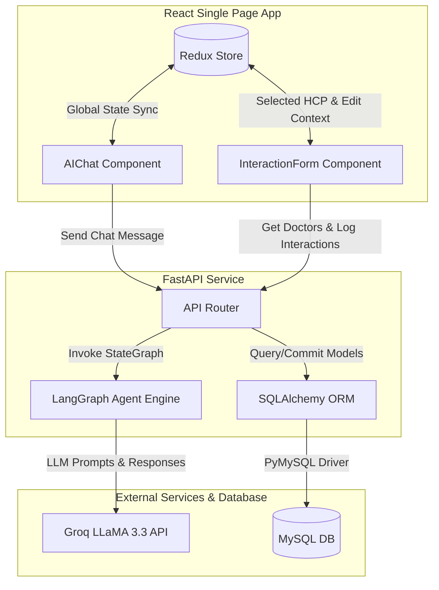
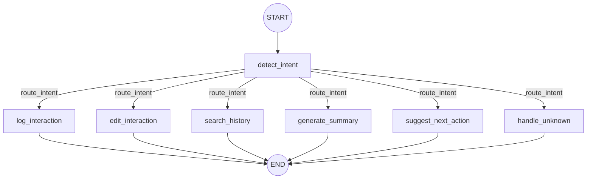
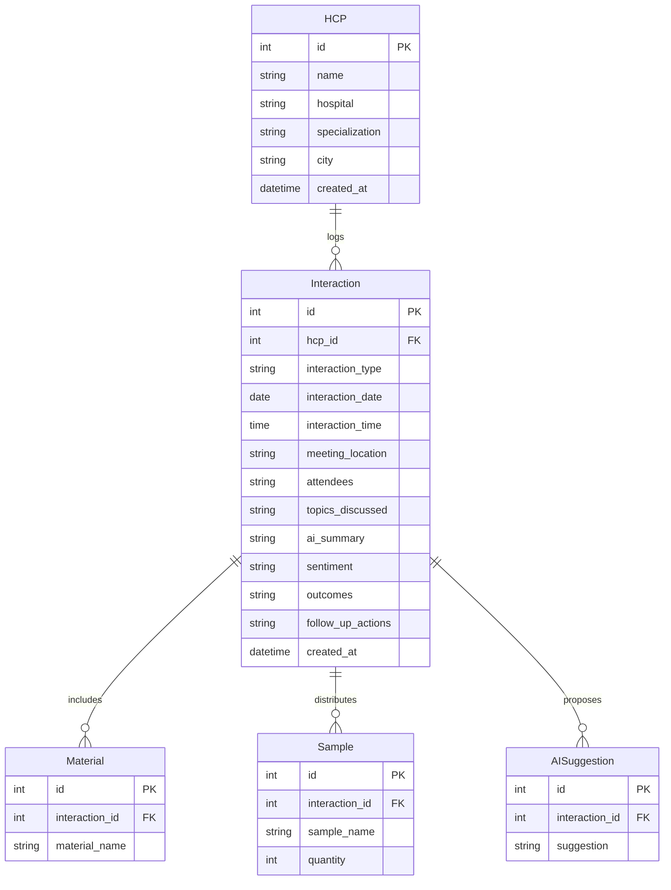

# AI-First HCP CRM - Log Interaction Module

An intelligent, AI-first Customer Relationship Management (CRM) log interaction screen designed specifically for medical representatives in the life sciences sector. This application integrates an advanced conversational interface with standard CRM data-logging pipelines, enabling medical representatives to quickly log detailed interactions, clinical trials, sample distributions, and follow-ups with Healthcare Professionals (HCPs) using natural language.

---

## 🚀 Key Features

* **Intelligent LangGraph Router Agent (Groq & LLaMA 3.3)**: Natural language chat interface that dynamically classifies user inputs into specific intents (`log`, `edit`, `history`, `summary`, `next_action`, or `unknown`) using LLaMA-3.3, routing them to specialized nodes using conditional StateGraph edges.
* **Direct Database ORM Node Operations**: Agent nodes fetch doctor profiles, historical logs, and child lists directly from the database using SQLAlchemy ORM `SessionLocal` to implement live edits, search history lookup, and context-rich suggestions.
* **Reactive Autocomplete HCP Search**: Debounced database query component that matches name, hospital, or specialty, automatically selecting the HCP when a unique match is returned.
* **Dynamic Location Fallback & Sentiment Normalization**: Prioritizes AI extracted locations, manually input values, and the doctor's primary hospital in a priority waterfall, while standardizing sentiments into `Positive`, `Negative`, and `Neutral`.
* **Enhanced Markdown Chat Formatting**: History and next-action recommendation nodes format their output dynamically as markdown layout templates with sentiment markers and structured bullet points directly in the chat UI.
* **Redux Global State Management**: Centralized store tracking form data, toast notifications, active editing ID, chat histories, and selected HCP context.

---

## 🛠️ Architecture Overview

The system is split into a **React + Redux** single-page application and a **FastAPI + SQLAlchemy** backend connected to a **MySQL** database.



### LangGraph Workflow

The AI agent compiles into an intent-aware conditional StateGraph:

1. **Detect Intent Node (`detect_intent`)**: Uses LLaMA 3.3 to classify the input message.
2. **Conditional Edge Router (`route_intent`)**: Routes dynamically to one of the five specialized tools or default handler.
3. **Log Interaction Node (`log_interaction`)**: Runs structured data extraction, summary, and action items sequentially.
4. **Edit Interaction Node (`edit_interaction`)**: Extracts doctor name and changes, updates modified columns/lists, and commits directly.
5. **Search History Node (`search_history`)**: Lists past interactions formatted in a clean markdown list.
6. **Generate Summary Node (`generate_summary`)**: Analyzes total database interaction history to write an overall relationship report.
7. **Suggest Next Action Node (`suggest_next_action`)**: Suggests 3-5 next meeting steps and sample distributions based on history.



---

## 📊 Database Models & Relationships



---

## ⚡ API Endpoints

### 🩺 Healthcare Professionals (HCPs)
* `GET /hcps/` - Lists all registered doctors.
* `GET /hcps/search?q={query}` - Autocomplete search by name, hospital, or specialty.
* `POST /hcps/` - Creates a new doctor record.
* `PUT /hcps/{id}` - Updates a doctor's profile.

### 📝 Interactions
* `POST /interactions/` - Logs a new representative-HCP interaction, parsing samples and evaluating location fallback.
* `PUT /interactions/{id}` - Updates an existing log, executing transactional delete-and-reinsert list synchronization.
* `GET /interactions/{id}` - Retrieves a specific interaction log by ID.
* `GET /interactions/history/{hcp_id}` - Retrieves historical interaction logs for a given physician ordered by date and ID descending.

### 🤖 AI Agent Chat
* `POST /chat/` - Takes raw conversation/notes, invokes the LangGraph pipeline, and returns extracted JSON data, summary, and action suggestions.

---

## ⚙️ Setup & Installation

### Backend Setup

1. **Navigate to backend and configure environment**:
   Create a `.env` file inside the `backend/` directory:
   ```env
   DATABASE_URL=mysql+pymysql://<user>:<password>@localhost:3306/hcp_crm
   GROQ_API_KEY=gsk_...
   ```

2. **Activate the Virtual Environment**:
   ```powershell
   # Windows PowerShell
   .venv\Scripts\activate
   ```

3. **Install Dependencies**:
   ```bash
   pip install -r requirements.txt
   ```

4. **Run the FastAPI App**:
   ```bash
   python run.py
   ```
   The backend will be available at `http://127.0.0.1:8000`.

---

### Frontend Setup

1. **Navigate to frontend directory**:
   ```bash
   cd frontend
   ```

2. **Install Dependencies**:
   ```bash
   npm install
   ```

3. **Start Development Server**:
   ```bash
   npm run dev
   ```
   The Vite app will open at `http://localhost:5173`.
